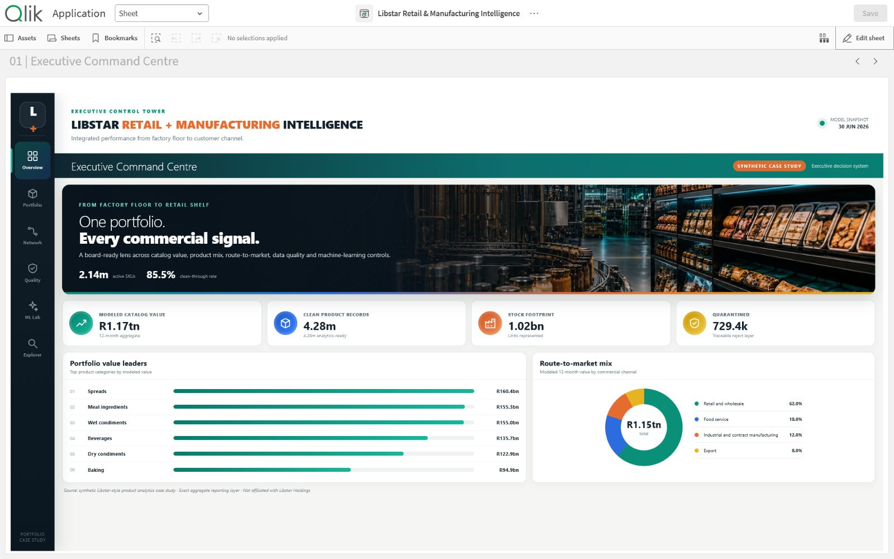

# ShelfLine Retail & Manufacturing Intelligence

An employer-facing Qlik Sense Desktop case study that turns the verified Libstar-style aggregate and ML layers into a six-page executive decision system.

## What stands out

- A purpose-built retail/manufacturing visual language: graphite control tower, teal retail signals, copper production signals, blue distribution analysis and saffron control alerts.
- Original, non-branded factory-to-shelf hero artwork supplied with the extension.
- Exact aggregate reporting over 5.01M raw product records, 4.28M analytics-ready records and R1.17tn of modeled 12-month catalog value.
- Transparent data-quality reconciliation: clean records plus 729.4k quarantined records equal the raw landing-zone count.
- Responsible ML storytelling: validation R², MAE, training population, product behavior segments and a human-review anomaly queue.

## Six aligned pages

1. Executive Command Centre
2. Category & Brand Portfolio
3. Channel & Regional Network
4. Data Quality Control
5. ML Decision Lab
6. Product Exception Explorer

## Open in Qlik Sense Desktop

1. Copy `ShelfLine Retail and Manufacturing Intelligence.qvf` to `Documents/Qlik/Sense/Apps`.
2. Copy the `libstar-command-intelligence` extension folder to `Documents/Qlik/Sense/Extensions`.
3. Launch Qlik Sense Desktop and open the app.

The extension is included because the six sheets use a custom full-screen visualization to achieve the portfolio-ready layout.

## Data and interpretation notes

- This is a synthetic portfolio case study based on a public FMCG operating model; it is not affiliated with Libstar Holdings.
- `revenue_12m_zar` is presented as modeled catalog value, not audited company revenue.
- ML anomalies are candidates for commercial investigation, not automatic errors or deletion decisions.
- Source files are the exact aggregate reporting layer in the original project repository.
